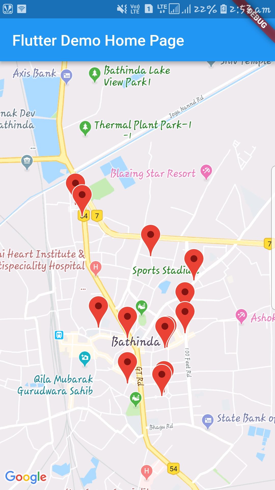
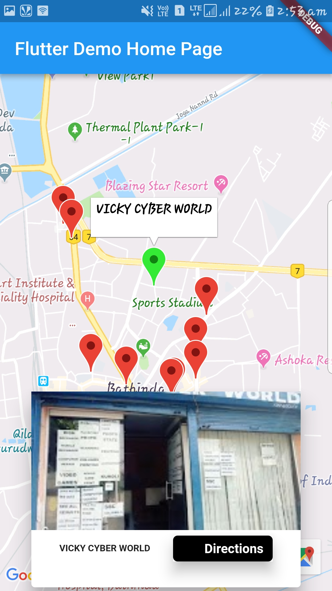
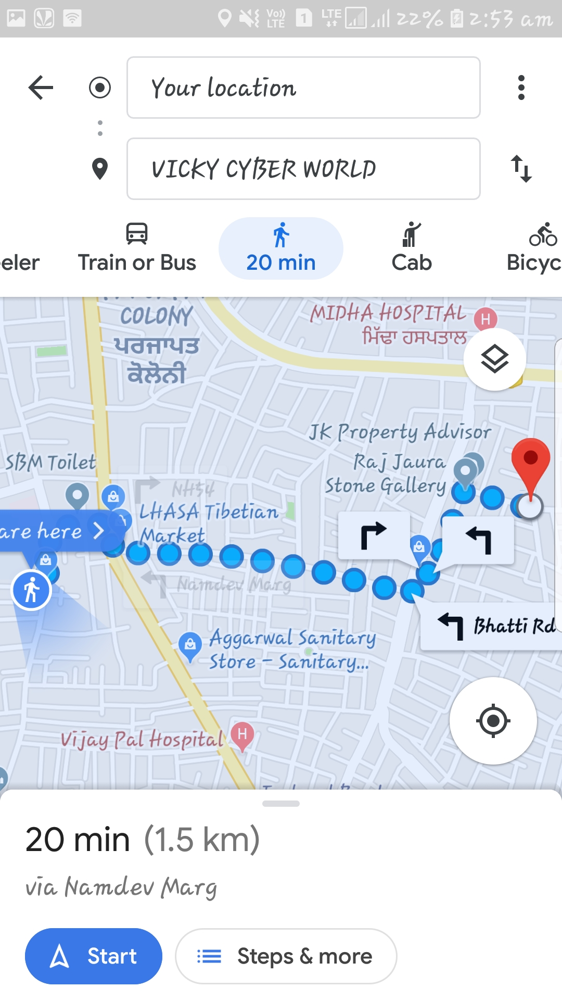

# finder

A new Flutter project.

## Getting Started

This project is a starting point for a Flutter application.

A few resources to get you started if this is your first Flutter project:

- [Lab: Write your first Flutter app](https://flutter.io/docs/get-started/codelab)
- [Cookbook: Useful Flutter samples](https://flutter.io/docs/cookbook)

For help getting started with Flutter, view our 
[online documentation](https://flutter.io/docs), which offers tutorials, 
samples, guidance on mobile development, and a full API reference.

<H2>Features</H2>

<UL>
<LI>Decode JSON with models to communicate with remote services&nbsp; 
<LI>Add Google maps, routes, and places to create comprehensive map applications&nbsp; 
<LI>Manage state changes using the Scoped Model, Bloc and Redux architecture patterns </LI></UL>

<H2>Api Used<H2>

- [Location : To get current location of the user](https://pub.dartlang.org/packages/location)  
- [Google Maps : To integerate google maps](https://pub.dartlang.org/packages/google_maps_flutter)
- [Google Maps Webservices : To get nearby shops](https://pub.dartlang.org/packages/google_maps_webservice)
- [Url Launcher](https://pub.dartlang.org/packages/url_launcher)

<H2>Images<H2>

 

 
